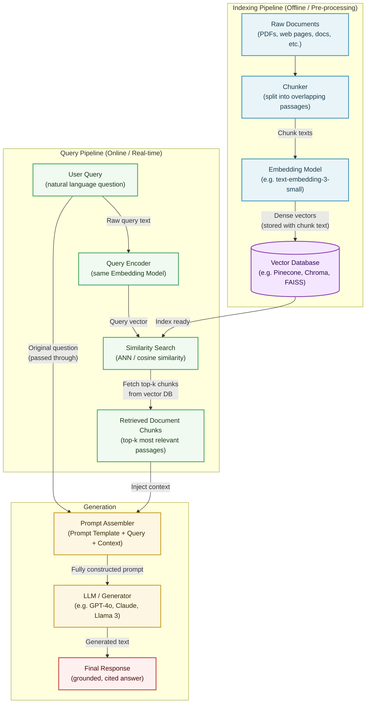

# RAG Architecture Diagram

## 1. Diagram Type & Rationale

`flowchart TD` (top-down) with subgraphs — best fit because RAG has a clear directional pipeline, and subgraphs let us visually separate the **offline indexing path** from the **online query path** while showing the shared Vector Database connection.

---

## 2. Mermaid Diagram

---

## 3. Key Elements Explained

| Component | Role |
|---|---|
| **Embedding Model** | Shared linchpin — used in *both* pipelines. Chunks and queries must be in the same vector space for similarity search to work. |
| **Vector Database** | The only stateful component. Stores vectors + source text + metadata. Everything else is stateless per request. |
| **Chunker** | Splits docs into overlapping passages (~512 tokens) so each piece is semantically coherent. |
| **Similarity Search** | ANN (Approximate Nearest Neighbor) search via cosine similarity — finds the top-k passages closest to the query vector. |
| **Prompt Assembler** | Where the "Augmentation" in RAG actually happens — injects retrieved context into the prompt template alongside the original query. |
| **User Query (dual path)** | The original query takes **two independent paths**: one encoded for retrieval, one raw for the prompt — both are needed. |

---

## 4. Optional Extensions

- **Reranker** — insert a `cross-encoder reranker` node between `Similarity Search` and `Retrieved Chunks` for production precision
- **Query Rewriter** — add a `Query Rewriter (LLM)` node before the encoder (HyDE, multi-query, step-back prompting)
- **Output Guardrails** — add a `Safety / Hallucination Filter` between the LLM and Final Response for enterprise use cases
- **Alternative view** — use `sequenceDiagram` if you want to show latency and request/response timing across named actors (User ↔ Vector DB ↔ LLM)
