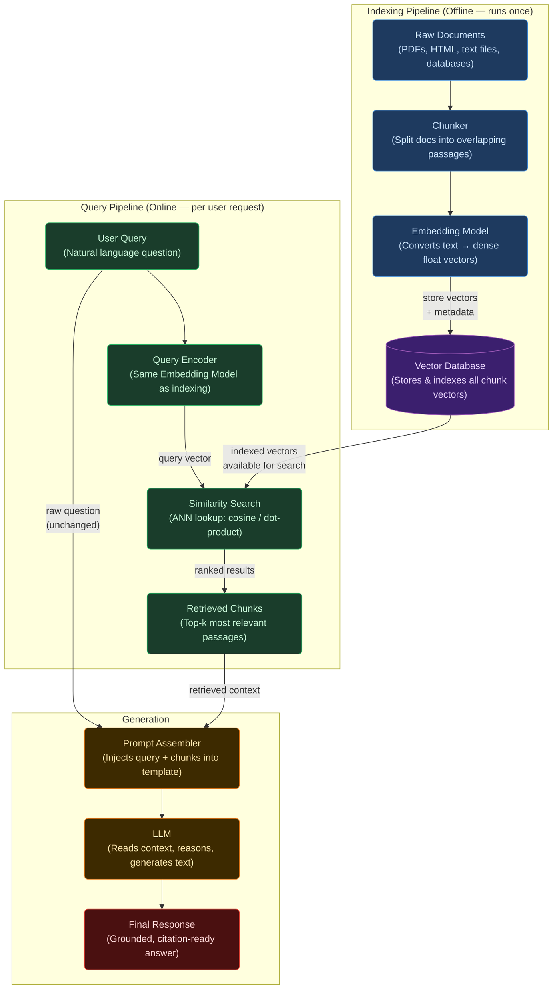

# RAG Architecture Diagram v2 (with ASCII Concept Map)

## Concept Summary

**RAG in one sentence:** Store knowledge as searchable vectors → at query time, find the most relevant chunks → stuff them into the LLM prompt so it answers *from your data*, not just its training.

```
OFFLINE (once)                  ONLINE (per query)
──────────────────              ────────────────────────────────────────
[Docs]                          [User Question]
  │                                │              │
  ▼                                ▼              │ (passed through raw)
[Chunk]                         [Embed]           │
  │                                │              │
  ▼                                ▼              │
[Embed] ──vectors──► [VecDB] ◄─── search          │
                         │                        │
                         ▼                        │
                    [Top-k Chunks] ───────► [Prompt Assembler]
                                                  │
                                                  ▼
                                               [LLM]
                                                  │
                                                  ▼
                                              [Answer]
```

---

## 1. Diagram Type & Rationale

`flowchart TD` with three subgraphs — mirrors the ASCII skeleton exactly: offline flows into online, online flows into generation. The phase boundaries become visible fences.

---

## 2. Mermaid Diagram



---

## 3. Component Table

| Component | Role |
|---|---|
| **Raw Documents** | Source corpus — any text you want the LLM to cite from. |
| **Chunker** | Splits long docs into focused passages (256–512 tokens, with overlap) so vectors stay semantically tight. |
| **Embedding Model** | Shared linchpin — encodes both chunks *and* queries into the same vector space so similarity search is meaningful. |
| **Vector Database** | The only stateful component; persists vectors + metadata and serves ANN search at query time. |
| **User Query** | Takes two parallel paths: one encoded (retrieval), one raw (prompt) — both are required. |
| **Similarity Search** | Cosine / dot-product ANN lookup — returns the top-k chunks closest to the query vector. |
| **Prompt Assembler** | Where "Augmentation" happens — merges the raw question + retrieved chunks into a structured LLM prompt. |
| **LLM** | Reads the assembled context and generates a grounded answer rather than relying solely on training weights. |
| **Final Response** | Traceable back to source passages — not hallucinated from model weights alone. |

---

## 4. Three Extensions to Add Next

1. **Re-Ranker** — between Similarity Search → Retrieved Chunks; a cross-encoder (Cohere Rerank, BGE) re-scores candidates more precisely than ANN distance
2. **Query Rewriter** — before Query Encoder; a small LLM rephrases/expands the query (HyDE, multi-query) to improve recall when user phrasing differs from source docs
3. **Faithfulness Check** — after LLM; an NLI model or second LLM call verifies each claim is supported by the retrieved chunks before the answer reaches the user
