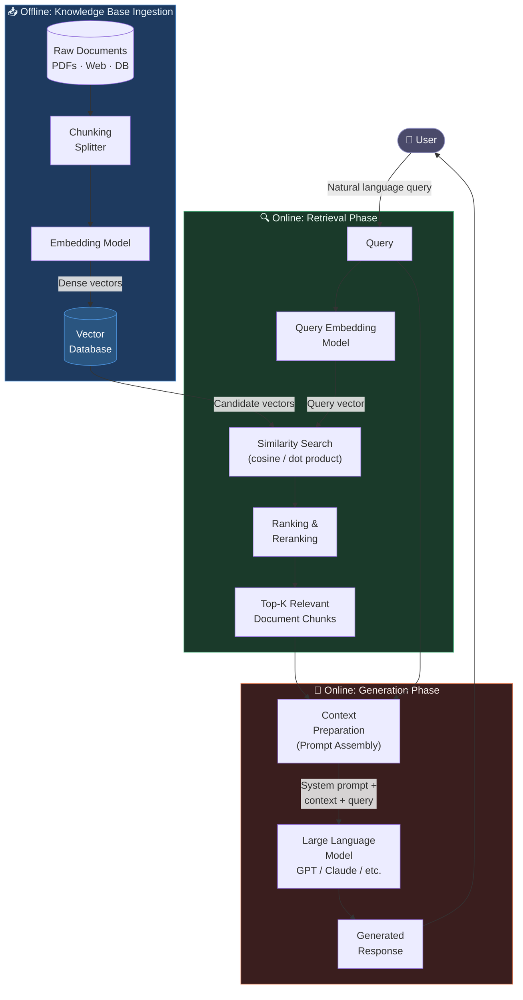

# RAG (Retrieval-Augmented Generation) Architecture Diagram

## Phase Summary

| Phase | Description |
|-------|-------------|
| **Ingestion** | Split documents into chunks → generate embedding vectors → store in Vector DB (offline) |
| **Query Embedding** | Vectorize user query using the same embedding model |
| **Similarity Search** | Calculate cosine similarity between query vector and DB vectors |
| **Reranking** | Re-order Top-K chunks by relevance score |
| **Context Prep** | Assemble system prompt + retrieved chunks + original query into a single prompt |
| **LLM Generation** | Generate a grounded, accurate response using the assembled context |
