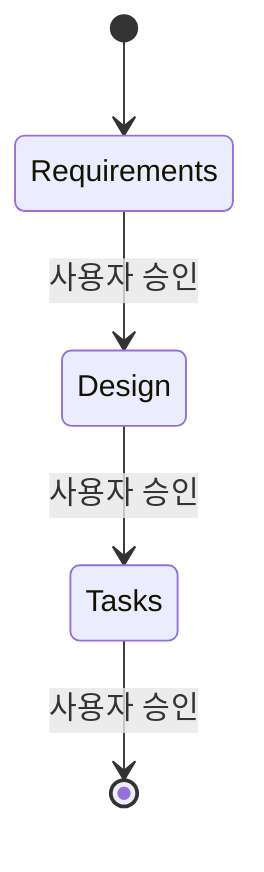

# `.claude` 디렉토리 구조 및 파일 역할 가이드

## 개요

`.claude` 디렉토리는 **Spec 기반 개발 워크플로우(Spec-Driven Development)**를 구성하는 에이전트, 설정, 시스템 프롬프트를 담고 있습니다.
거친 아이디어를 요구사항 → 설계 → 구현 태스크 목록으로 단계적으로 변환하는 구조화된 개발 프로세스를 자동화합니다.

---

## 디렉토리 구조

```
.claude/
├── agents/
│   └── kfc/
│       ├── spec-requirements.md       # 요구사항 문서 작성 에이전트
│       ├── spec-design.md             # 설계 문서 작성 에이전트
│       ├── spec-tasks.md              # 구현 태스크 목록 작성 에이전트
│       ├── spec-impl.md               # 코드 구현 실행 에이전트
│       ├── spec-judge.md              # 문서 품질 평가 에이전트
│       ├── spec-test.md               # 테스트 문서/코드 작성 에이전트
│       └── spec-system-prompt-loader.md  # 워크플로우 시작점 로더
├── settings/
│   └── kfc-settings.json             # 경로 및 뷰 설정
└── system-prompts/
    └── spec-workflow-starter.md      # 전체 워크플로우 마스터 프롬프트
```

---

## 파일별 역할

### 1. `system-prompts/spec-workflow-starter.md` — 마스터 워크플로우 프롬프트

**전체 Spec 워크플로우의 핵심 지휘자**입니다.

- 아이디어 → 요구사항 → 설계 → 태스크 목록의 3단계 흐름을 정의
- 각 단계에서 사용자 승인 없이 다음 단계로 진행하지 않는 검토-수정 루프 규칙 설정
- 병렬 에이전트 실행 전략 (동시에 여러 sub-agent 실행 후 `spec-judge`로 최선안 선택)
- 태스크 실행 모드 정의: 기본(순차), 병렬(명시 요청 시), 자동(의존성 분석 후 최적 병렬)
- sub-agent와 메인 스레드의 역할 분리 원칙 명시



---

### 2. `agents/kfc/spec-system-prompt-loader.md` — 워크플로우 진입점

**워크플로우 시작 시 가장 먼저 호출되는 에이전트**입니다.

- 현재 작업 디렉토리를 읽어 `spec-workflow-starter.md`의 절대 경로를 반환
- 별도 로직 없이 경로 문자열만 출력 (도구 사용 금지)
- 메인 스레드가 이 경로를 읽어 워크플로우 지침을 로드

---

### 3. `agents/kfc/spec-requirements.md` — 요구사항 작성 에이전트

**EARS(Easy Approach to Requirements Syntax) 형식의 요구사항 문서를 생성**합니다.

**주요 역할:**
- 기능 설명으로부터 EARS 형식 요구사항 초안 자동 생성
- 사용자와 반복적으로 검토하며 요구사항 정제
- `requirements.md` 파일 생성 및 업데이트

**EARS 키워드:** `WHEN`, `IF`, `WHERE`, `WHILE` + `SHALL`

**출력 위치:** `.claude/specs/{feature_name}/requirements.md`

---

### 4. `agents/kfc/spec-design.md` — 설계 문서 작성 에이전트

**요구사항 기반의 기술 설계 문서를 작성**합니다.

**주요 역할:**
- `requirements.md` 읽고 아키텍처 설계
- Mermaid 다이어그램으로 시스템 구조, 데이터 흐름, 비즈니스 프로세스 시각화
- 컴포넌트 설계, 데이터 모델, 에러 처리 전략 포함

**문서 구조:**
```
Overview → Architecture → Components → Data Model → Business Process → Error Handling → Testing Strategy
```

**출력 위치:** `.claude/specs/{feature_name}/design.md`

---

### 5. `agents/kfc/spec-tasks.md` — 태스크 목록 작성 에이전트

**설계를 실행 가능한 코딩 태스크 체크리스트로 변환**합니다.

**주요 역할:**
- `requirements.md` + `design.md` 기반으로 구현 단계 분해
- 각 태스크에 관련 요구사항 참조 포함 (예: `_Requirements: 1.1, 2.3_`)
- Mermaid 태스크 의존성 다이어그램 생성 (병렬 실행 지원용)
- 테스트 주도 개발(TDD) 우선 순서 배치

**형식 예시:**
```markdown
- [ ] 1. 프로젝트 구조 설정
- [ ] 2.1 핵심 데이터 모델 구현
  - _Requirements: 1.2, 2.1_
- [ ] 2.2 검증 로직 구현
```

**출력 위치:** `.claude/specs/{feature_name}/tasks.md`

---

### 6. `agents/kfc/spec-impl.md` — 코드 구현 에이전트

**태스크 목록의 특정 태스크 ID를 받아 실제 코드를 구현**합니다.

**주요 역할:**
- `task_id`(예: `"2.1"`)로 지정된 단일 태스크만 실행
- `requirements.md`, `design.md`, `tasks.md` 참조하여 구현
- 완료 시 `tasks.md`의 `- [ ]`를 `- [x]`로 마킹
- 기존 코드베이스 컨벤션 엄수, 설계 아키텍처 준수

**병렬 실행:** 의존성이 없는 태스크는 여러 인스턴스 동시 실행 가능

---

### 7. `agents/kfc/spec-judge.md` — 문서 품질 평가 에이전트

**병렬 생성된 여러 버전의 spec 문서를 평가하여 최선안 선택**합니다.

**평가 기준 (각 25점):**
| 항목 | 내용 |
|------|------|
| 완성도 | 필수 내용 누락 여부 |
| 명확성 | 표현과 구조의 논리성 |
| 실현가능성 | 구현 난이도 고려 여부 |
| 혁신성 | 독창적 접근 여부 |

**동작 방식:**
1. n개 문서를 평가 (최대 4개씩 그룹화)
2. 각 그룹에서 최선안 선택
3. 최종 1개 선택 후 4자리 랜덤 접미사 파일명으로 저장 (예: `requirements_v3456.md`)
4. 평가 대상 입력 문서 삭제

---

### 8. `agents/kfc/spec-test.md` — 테스트 작성 에이전트

**구현 코드에 대한 테스트 문서와 실행 가능한 테스트 코드를 함께 생성**합니다.

**주요 역할:**
- `task_id` 기반으로 관련 요구사항, 설계, 구현 코드 파악
- 테스트 케이스 문서 (`{module}.md`) 작성
- 실행 가능한 테스트 코드 (`{module}.test.ts`) 생성
- 두 파일은 1:1 대응 (문서의 각 케이스 = 코드의 각 `it` 블록)
- AAA 패턴(Arrange-Act-Assert) 준수, 경계 조건 및 에러 시나리오 포함

---

### 9. `settings/kfc-settings.json` — 경로 및 뷰 설정

**워크플로우에서 사용하는 경로와 UI 표시 설정**을 정의합니다.

```json
{
  "paths": {
    "specs": ".claude/specs",       // spec 문서 저장 위치
    "steering": ".claude/steering", // 스티어링 규칙 위치
    "settings": ".claude/settings"  // 설정 파일 위치
  },
  "views": {
    "specs": { "visible": true },   // UI에서 specs 탭 표시
    "steering": { "visible": true },
    "mcp": { "visible": true },
    "settings": { "visible": false } // settings 탭 숨김
  }
}
```

---

## 전체 워크플로우 흐름

```
사용자 아이디어 입력
        ↓
spec-system-prompt-loader  →  spec-workflow-starter.md 경로 반환
        ↓
[1단계] spec-requirements (1~128개 병렬)
        ↓  병렬 실행 시 spec-judge로 최선안 선택
사용자 검토 & 승인
        ↓
[2단계] spec-design (1~128개 병렬)
        ↓  병렬 실행 시 spec-judge로 최선안 선택
사용자 검토 & 승인
        ↓
[3단계] spec-tasks (1~128개 병렬)
        ↓  병렬 실행 시 spec-judge로 최선안 선택
사용자 검토 & 승인
        ↓
[구현] spec-impl (태스크별 실행)
[테스트] spec-test (태스크별 실행)
```

---

## 핵심 설계 원칙

1. **단계별 사용자 승인 필수** — 명시적 승인 없이 다음 단계 진행 불가
2. **병렬 생성 + 품질 평가** — 여러 버전 생성 후 `spec-judge`가 최선안 선택
3. **메인 스레드 vs sub-agent 역할 분리** — 복잡한 작업은 sub-agent, 프로세스 제어는 메인 스레드
4. **작은 수정은 메인 스레드 직접 처리** — 포맷, 버전 번호 등은 메인 스레드가 직접 편집
5. **단일 책임 원칙** — 각 에이전트는 자신의 역할만 수행
