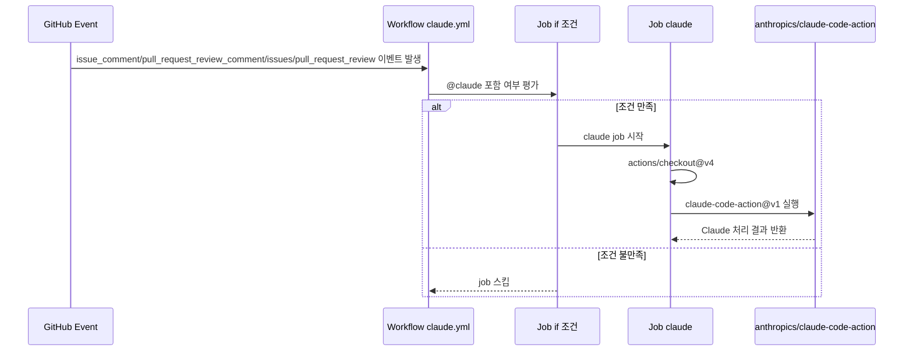
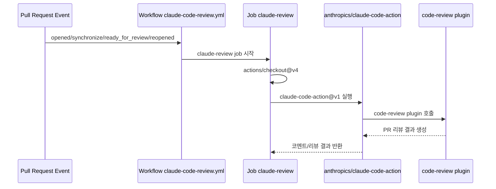

# GitHub Workflows 실행 조건/동작 정리

이 문서는 `.github/workflows` 하위 워크플로가 **언제 실행되고**, **무엇을 수행하는지**를  
`논리적 조건 | 논리적 동작 | 실제 GitHub Actions 코드` 관점으로 정리합니다.

## 1) `claude.yml` (`Claude Code`)

### 워크플로 개요
- 목적: 이슈/PR 관련 이벤트에서 `@claude` 멘션이 있는 경우 Claude Code Action 실행
- 트리거 이벤트:
  - `issue_comment.created`
  - `pull_request_review_comment.created`
  - `issues.opened`, `issues.assigned`
  - `pull_request_review.submitted`

### 논리 매트릭스

| 논리적 조건 | 논리적 동작 | 실제 GitHub Actions 코드 |
| --- | --- | --- |
| 이슈 댓글 생성 이벤트이고 댓글 본문에 `@claude` 포함 | `claude` job 실행 | `github.event_name == 'issue_comment' && contains(github.event.comment.body, '@claude')` |
| PR 리뷰 댓글 생성 이벤트이고 댓글 본문에 `@claude` 포함 | `claude` job 실행 | `github.event_name == 'pull_request_review_comment' && contains(github.event.comment.body, '@claude')` |
| PR 리뷰 제출 이벤트이고 리뷰 본문에 `@claude` 포함 | `claude` job 실행 | `github.event_name == 'pull_request_review' && contains(github.event.review.body, '@claude')` |
| 이슈 이벤트(`opened` 또는 `assigned`)이고 이슈 본문/제목 중 하나에 `@claude` 포함 | `claude` job 실행 | `github.event_name == 'issues' && (contains(github.event.issue.body, '@claude') || contains(github.event.issue.title, '@claude'))` |
| 위 조건 중 하나도 만족하지 않음 | job 미실행 | `jobs.claude.if` 전체 OR 조건 불만족 |
| job 실행됨 | 리포지토리 checkout 후 Claude Code Action 실행 | `actions/checkout@v4` → `anthropics/claude-code-action@v1` |
| Claude가 PR CI 결과를 읽어야 함 | Actions read 권한 부여 | `permissions.actions: read` + `additional_permissions: actions: read` |

### 코드 근거

```14:41:.github/workflows/claude.yml
  claude:
    if: |
      (github.event_name == 'issue_comment' && contains(github.event.comment.body, '@claude')) ||
      (github.event_name == 'pull_request_review_comment' && contains(github.event.comment.body, '@claude')) ||
      (github.event_name == 'pull_request_review' && contains(github.event.review.body, '@claude')) ||
      (github.event_name == 'issues' && (contains(github.event.issue.body, '@claude') || contains(github.event.issue.title, '@claude')))
    runs-on: ubuntu-latest
    permissions:
      contents: read
      pull-requests: read
      issues: read
      id-token: write
      actions: read # Required for Claude to read CI results on PRs
...
      - name: Run Claude Code
        id: claude
        uses: anthropics/claude-code-action@v1
        with:
          claude_code_oauth_token: ${{ secrets.CLAUDE_CODE_OAUTH_TOKEN }}
          additional_permissions: |
            actions: read
```

### 시퀀스 다이어그램



## 2) `claude-code-review.yml` (`Claude Code Review`)

### 워크플로 개요
- 목적: PR lifecycle 이벤트에서 자동 코드 리뷰 플러그인 실행
- 트리거 이벤트:
  - `pull_request.opened`
  - `pull_request.synchronize`
  - `pull_request.ready_for_review`
  - `pull_request.reopened`

### 논리 매트릭스

| 논리적 조건 | 논리적 동작 | 실제 GitHub Actions 코드 |
| --- | --- | --- |
| PR이 열림 | 코드 리뷰 워크플로 실행 | `on.pull_request.types: [opened, ...]` |
| PR에 새 커밋이 푸시됨(`synchronize`) | 최신 변경 기준으로 리뷰 재실행 | `types: [..., synchronize, ...]` |
| Draft PR이 Ready for review로 전환됨 | 코드 리뷰 실행 | `types: [..., ready_for_review, ...]` |
| 닫혔던 PR이 다시 열림 | 코드 리뷰 재실행 | `types: [..., reopened]` |
| (현재 기준) 작성자 필터 없음 | 모든 PR 작성자 대상으로 실행 | `jobs.claude-review.if`가 주석 처리됨 |
| job 실행됨 | checkout 후 code-review 플러그인 기반 Claude Action 실행 | `plugins: 'code-review@claude-code-plugins'` + `/code-review:code-review ...` 프롬프트 |
| 특정 파일 변경에서만 실행하고 싶음 | `paths` 조건 추가 가능(현재 비활성) | `# paths:` 주석 블록 |

### 코드 근거

```3:41:.github/workflows/claude-code-review.yml
on:
  pull_request:
    types: [opened, synchronize, ready_for_review, reopened]
    # Optional: Only run on specific file changes
    # paths:
    #   - "src/**/*.ts"
...
jobs:
  claude-review:
    # Optional: Filter by PR author
    # if: |
    #   github.event.pull_request.user.login == 'external-contributor' ||
    #   github.event.pull_request.user.login == 'new-developer' ||
    #   github.event.pull_request.author_association == 'FIRST_TIME_CONTRIBUTOR'
...
      - name: Run Claude Code Review
        id: claude-review
        uses: anthropics/claude-code-action@v1
        with:
          claude_code_oauth_token: ${{ secrets.CLAUDE_CODE_OAUTH_TOKEN }}
          plugin_marketplaces: 'https://github.com/anthropics/claude-code.git'
          plugins: 'code-review@claude-code-plugins'
          prompt: '/code-review:code-review ${{ github.repository }}/pull/${{ github.event.pull_request.number }}'
```

### 시퀀스 다이어그램



## 운영 관점 요약

- `claude.yml`은 **멘션 기반 수동 호출** 성격이 강함 (`@claude`가 핵심 게이트).
- `claude-code-review.yml`은 **PR 상태 변화 기반 자동 실행** 성격이 강함.
- 둘 다 `CLAUDE_CODE_OAUTH_TOKEN` secret이 없으면 실제 Action 단계 수행이 실패한다.
