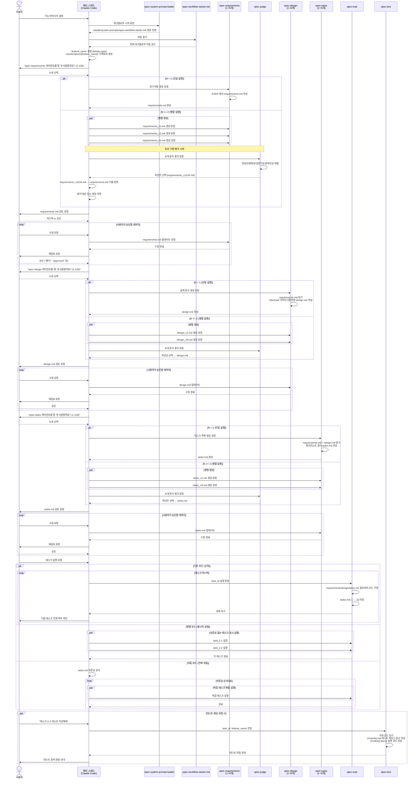
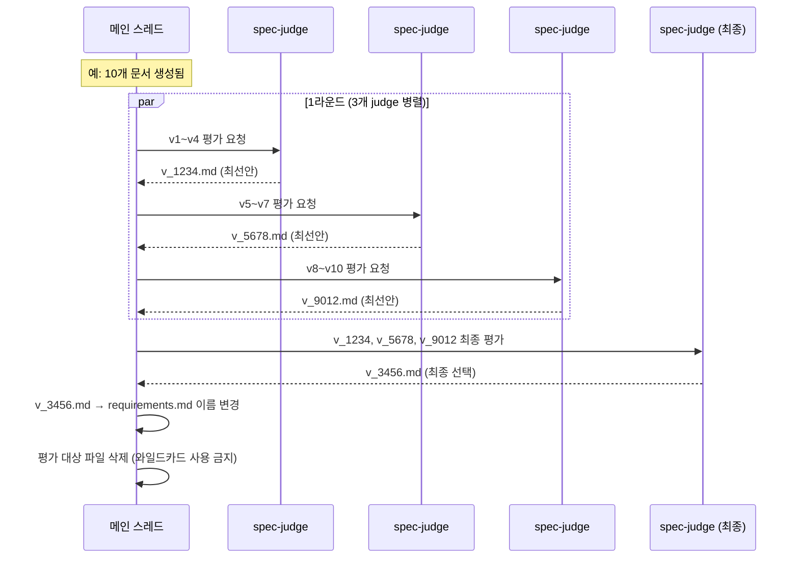

# Spec 워크플로우 시퀀스 다이어그램

## 전체 흐름 개요



---

## spec-judge 트리 기반 평가 상세

병렬로 N개 문서가 생성된 경우, spec-judge는 다음 트리 구조로 평가합니다.



---

## 생성 파일 위치

```
.claude/specs/{feature_name}/
├── requirements.md   ← 1단계 완료 후
├── design.md         ← 2단계 완료 후
└── tasks.md          ← 3단계 완료 후
```
