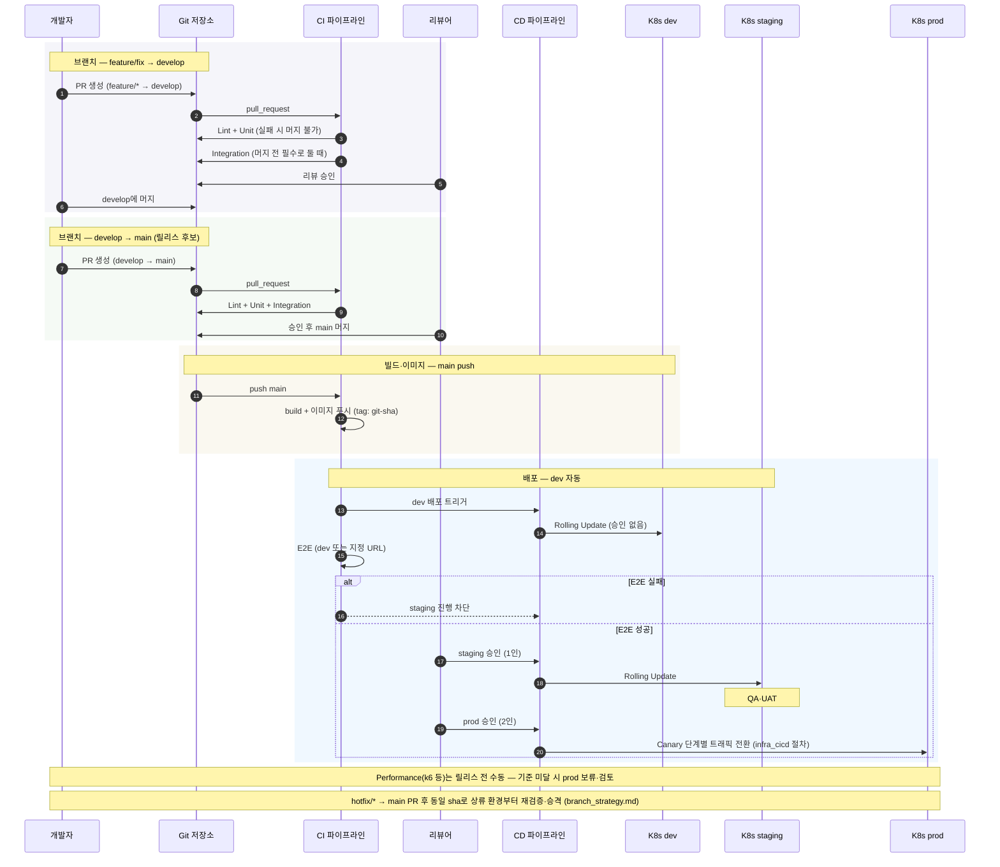

# Common Spec — 배포 전략 (Deployment Strategy)

> `infra_cicd.md`의 CD·K8s·Helm·롤백 상세와, `testing_strategy.md`의 **테스트 게이트**를 배포 단계에 명시적으로 연결한다.

---

## 목적

- **dev → staging → prod**로 이어지는 **프로모션**과 **승인·트리거**를 한곳에서 정의한다.
- 배포 전·후 **어떤 테스트가 차단 조건인지**를 반복 논의 없이 따를 수 있게 한다.

---

## 통합 시퀀스 (브랜치·테스트·배포)

아래는 `branch_strategy.md`의 PR 흐름, `testing_strategy.md`의 게이트, `infra_cicd.md`의 빌드·배포를 **한 줄기**로 본 것이다. (실제 워크플로 이름·job 분리는 저장소 YAML에 맞게 조정한다.)



---

## 환경 정의

| 환경 | K8s Namespace (예) | 목적 | 대표 사용자 |
|------|---------------------|------|-------------|
| dev | `dev` | `main` 반영 최신 기능 검증 | 개발자 |
| staging | `staging` | QA·UAT, 릴리스 후보 검증 | QA·PO |
| prod | `prod` | 실사용자 트래픽 | 고객 |

설정 값 분리: `infra_cicd.md` — ConfigMap / Secret, Helm `values-<env>.yaml`.

---

## 아티팩트 프로모션

```
CI 빌드 이미지
  tag: {git-sha} (불변)
       │
       ├──► dev 배포     (자동)
       ├──► staging 배포 (승인 후)
       └──► prod 배포   (승인 후, 동일 sha 또는 릴리스 태그)
```

- **동일 이미지 digest**를 상류→하류로 승격시키는 것을 원칙으로 하여, “스테이징에서 본 것”과 **바이너리 동일성**을 보장한다.
- `latest`만 운용하지 말고, 배포 기록에는 **반드시 `git-sha`(또는 그에 대응하는 immutable 태그)**를 남긴다 (`infra_cicd.md` 이미지 네이밍).

---

## 배포 트리거·승인

| 단계 | 트리거 | 승인 | 배포 방식 (기본) |
|------|--------|------|------------------|
| **dev** | `main` 머지 후 CI 성공 | 없음 | Rolling Update |
| **staging** | dev 배포 성공 또는 수동 워크플로 | 1인 | Rolling Update |
| **prod** | staging QA 완료 후 | 2인 | Rolling Update → Canary (`infra_cicd.md`) |

조직 규모에 따라 staging 승인을 생략할 수는 있으나, **prod 2인 승인**은 유지하는 것을 권장한다.

---

## 테스트 게이트와의 연계 (`testing_strategy.md`)

다음은 **배포 파이프라인 차단**과의 대응 관계다.

| 테스트 레이어 | 실행 시점 (스펙) | 배포 관점에서의 의미 |
|---------------|------------------|----------------------|
| Unit | PR 생성 즉시 | PR 단계에서 품질 확보 — 머지된 코드만 상류로 |
| Integration | PR 머지 전 | staging/prod 후보 이미지에 대한 회귀 방지 |
| E2E | main 머지 후 / 배포 전 | **staging 또는 prod 이전**에 실패 시 해당 환경 배포 차단 |
| Performance | 릴리스 전 수동 | 기준 미달 시 **prod 배포 보류·검토** |

**권장 연결:**

1. `main` 머지 후: E2E를 **dev** (또는 전용 E2E 타깃)에서 실행 → 실패 시 **staging CD 시작 차단**.
2. staging 검증 완료 후: 동일 sha로 prod 진행 → Canary 단계에서 에러율·SLI 모니터링 (`infra_cicd.md` Canary).

---

## 무중단·점진 배포

- **Rolling Update**: `maxUnavailable: 0` 등으로 무중단 유지 (`infra_cicd.md` Deployment).
- **Canary (prod)**:
  1. 트래픽 10% → 대기 → 에러율 기준 확인
  2. 50% → 대기 → 확인
  3. 100% 전환 후 구버전 종료

자동화 도구(Argo Rollouts, Flagger)는 `infra_cicd.md` 미결 과제에 따라 추후 반영한다.

---

## 롤백

| 상황 | 조치 |
|------|------|
| 신규 배포 직후 장애 | `kubectl rollout undo`로 이전 ReplicaSet으로 복귀 (`infra_cicd.md` 명령 예시) |
| 데이터 마이그레이션 포함 릴리스 | 롤백 전 **스키마·데이터 역방향** 절차를 릴리스 체크리스트에 별도 정의 |

롤백 후에는 동일 실패를 막기 위해 **hotfix 브랜치**로 근본 수정한다 (`branch_strategy.md`).

---

## 헬스·준비 상태

배포 직후 신버전이 트래픽을 받기 전에 **Readiness**가 성공해야 한다 (`infra_cicd.md` `/healthz`, `/ready`).  
LB·Ingress는 준비된 파드만 대상으로 삼는다.

---

## 체크리스트 (릴리스 담당)

- [ ] 배포 이미지 태그가 **머지된 커밋 sha**와 일치하는가
- [ ] staging에서 E2E·스모크 통과 기록이 있는가
- [ ] prod Canary 단계별 에러율·지표 모니터링 담당자가 지정됐는가
- [ ] Secrets·ConfigMap이 대상 환경 값으로 갱신됐는가

---

## 미결 기술 과제

- `infra_cicd.md`와 동일: Canary 자동화 도구, 멀티 클러스터, Secrets 저장소
- E2E 실패 시 **자동 롤백** 여부와 임계값

---

## 관련 문서

- `infra_cicd.md` — CI/CD 파이프라인, Docker·K8s·Helm·Canary·롤백 명령
- `testing_strategy.md` — 피라미드, CI 통합 매트릭스, E2E·성능 기준
- `branch_strategy.md` — main/develop·릴리스·핫픽스 흐름
